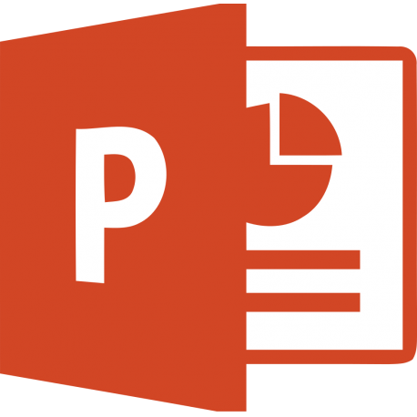
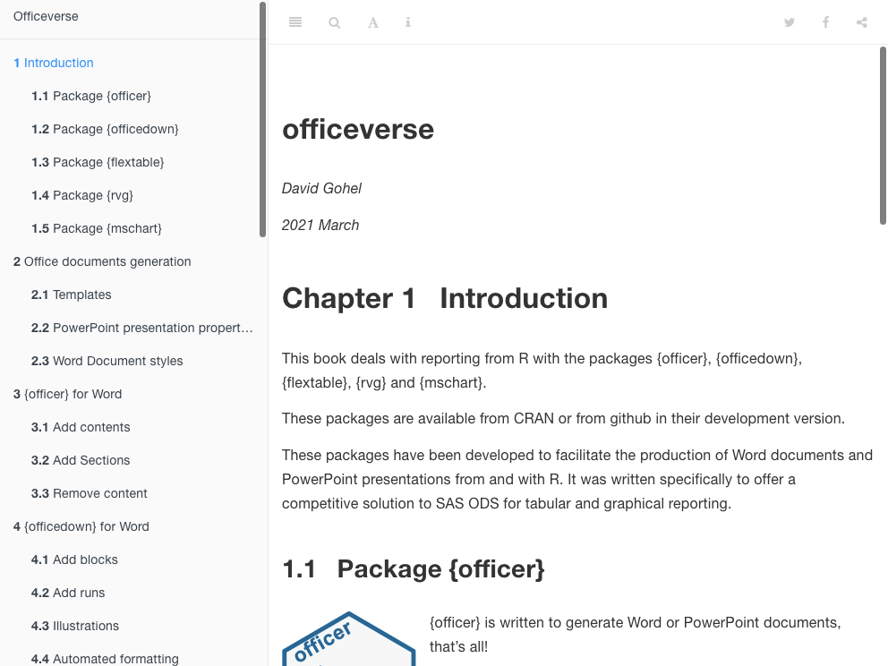

```{r setup, include=FALSE, message = FALSE, warning = FALSE}
library(dplyr)
library(ggplot2)
library(flextable)
library(officer)
library(knitr)
library(doconv)
library(data.table)

source("R/utilities.R")
knitr_opt_set("talk")

hook_source <- knitr::knit_hooks$get('source')
knitr::knit_hooks$set(source = function(x, options) {
  x <- stringr::str_replace(x, "^[[:blank:]]?([^*].+?)[[:blank:]]*#<<[[:blank:]]*$", "*\\1")
  hook_source(x, options)
})

```


# About me

.pull-left[

.center[

Me and my family

`r fontawesome::fa("male", height="3.4em", fill = "#C32900")` `r fontawesome::fa("female", height="3.4em")` `r fontawesome::fa("child", height="2.4em")` `r fontawesome::fa("baby", height="1.6em")`

Some of my open source

[](https://CRAN.R-project.org/package=ggiraph) [](https://CRAN.R-project.org/package=officer) [](https://CRAN.R-project.org/package=flextable) [](https://CRAN.R-project.org/package=officedown) [](https://CRAN.R-project.org/package=fpeek)


Funder of 


Based in Paris, France

]


]


.pull-right[

[at https://www.ardata.fr](https://www.ardata.fr)

`r fontawesome::fa("users-cog", height="1.7em")` With Clémentine and Panagiotis

`r fontawesome::fa("r-project", height="1.7em")` package development, deploiement, support, migration, shiny development

`r fontawesome::fa("server", height="1.7em")` scientific cloud computing environment (jupyterhub, RStudio, ...)


`r fontawesome::fa("chalkboard-teacher", height="1.7em")` R Trainings


]

---
class: middle, center

# Short introduction to 


---
## Why officer?

The officer package has been developed to facilitate the production of Word documents and PowerPoint presentations with R.

* Original motivation: 2013-2014, provide an alternative to SAS ODS 
for clinical report. Thanks to Jean-François Collin for the inital 
*support*.

* Strong interest from customers and users 

* Need a programmatic solution to generate Word and PowerPoint documents: R code
only.

---
## Package overview

.card.noborder[

.card.width-48[
.section[**1 - Word generation**]
.section.font-sm[

* create documents, append to documents
* support for tables, plots, {flextable}, paragraphs, TOC, ...
* support for sections


]
]


.card.width-48[
.section[**1 - PowerPoint generation**]
.section.font-sm[

* create documents, append to documents
* organise content in slides
* support for tables, plots, {flextable}, paragraphs, ...



]
]


.card.width-25[
.section[**3 - R Markdown support**]
.section.font-sm[

Support for chunks and blocks of output. Use the package {officedown} 
to make it easy.


]

]

.card.width-44[
.section[**4 - extensions**]
.section.font-sm[

Graphics can be edited in PowerPoint (and Excel) with package {rvg}.

Tables can be edited in PowerPoint and Word with package {flextable}.

Office charts can be generated in PowerPoint and Word with package {mschart}.

]
]


.card.width-25[
.section[**5 - Doc**]
.section.font-sm[

A detailed&nbsp;<a href="https://ardata-fr.github.io/officeverse/">documentation</a> with many illustrations is available, made with 


]
]


]


---
## History


* **2014-03-03**: ReporteRs first realease on CRAN.
* **2017-01-01**: ReporteRs is a mess!
* **2017-03-30**: officer first realease on CRAN.
* **2018-07-16**: ReporteRs archived on CRAN.
* **2018-07-06**: Look for a better integration with R Markdown...


---
class: inverse
background-image: url("static/assets/img/canards.jpg")

# Officeverse

```{css echo=FALSE}
.readable{
  color: white;
  font-weight: bold;
  background-color: #00000073;
  font-size: 1.3em;
}

```

.readable[


The officeverse is a collection of R packages designed to help R users to generate Word and PowerPoint outputs:

* {officer} is the spine
* {flextable} is for tabular reporting
* {officedown} brings officer features in R Markdown
* {rvg} is for editable vector graphics
* {mschart} is producing real Office charts (Its maintenance is interrupted but will be resumed soon)

]


---
## Documentation

User guide: https://ardata-fr.github.io/officeverse/


```{r include=FALSE, eval=!file.exists("static/assets/img/officeverse-book.png")}
webshot2::webshot("https://ardata-fr.github.io/officeverse/", 
                  file = "static/assets/img/officeverse-book.png")
```





---
## Editable Vector Graphics

`rvg::dml` function is a simple wrapper to mark the plot instructions as Vector Graphics instructions

```{r}
library(rvg)
my_gg <- ggplot(airquality, aes(Ozone,Wind)) + geom_point()
my_vec_graph <- dml(ggobj = my_gg) #<<

read_pptx() %>% 
  add_slide() %>% 
  ph_with(my_vec_graph, location = ph_location_fullsize() ) %>% 
  print(target = "reports/rvg.pptx")
```


[Download rvg.pptx](reports/rvg.pptx)

```{r echo=FALSE}
doconv::to_miniature(filename = "reports/rvg.pptx")
```


---
## Office charts

```{r}
library(mschart)
linec <- ms_linechart(
  data = mtcars, x = "mpg",
  y = "wt", group = "am")
linec <- chart_ax_y(linec, num_fmt = "0.00", rotation = -90)

read_pptx() %>% 
  add_slide() %>% 
  ph_with(linec, location = ph_location_fullsize() ) %>% 
  print(target = "reports/mschart.pptx")
```


[Download mschart.pptx](reports/mschart.pptx)

```{r echo=FALSE}
doconv::to_miniature(filename = "reports/mschart.pptx")
```


---
class: center, middle, inverse
# Officer for PowerPoint

---
## Verbs and supported outputs

.pull-left[

**Verbs**

* `read_pptx()`: read a pptx and return an object of class `rpptx`
* `add_slide()`: add a slide to `rpptx` object
* `ph_with()`: add content to a placeholder on the current slide
* `print(target = "...")`: write the result in a pptx file

]

.pull-right[

**Supported outputs**

* atomic vectors
* ggplot objects and plot (eventually as editable Vector Graphics)
* images
* flextables
* `block_list` and `fpar`

]

```{r}
my_gg <- ggplot(airquality, aes(Ozone,Wind)) + geom_point()
my_ft <- qflextable(head(airquality, n = 11))
read_pptx() %>% add_slide(layout = "Two Content") %>% 
  ph_with("My first slide", location = ph_location_type(type = "title")) %>% 
  ph_with(my_gg, location = ph_location_left()) %>% 
  ph_with(my_ft, location = ph_location_right()) %>% 
  print(target = "reports/first_example.pptx")
```

---

[Download first_example.pptx](reports/first_example.pptx)

```{r echo=FALSE}
doconv::to_miniature(filename = "reports/first_example.pptx")
```

---
## Using a template

Let's define a template...

[Download template.pptx](reports/template.pptx)


```{r}
read_pptx(path = "reports/template.pptx") %>% 
  add_slide(layout = "why_r_demo", master = "Thème Office") %>% 
  ph_with("My first slide", location = ph_location_type(type = "title")) %>% 
  ph_with(my_gg, location = ph_location_label(ph_label = "ph_left")) %>% #<<
  ph_with(my_ft, location = ph_location_label(ph_label = "ph_right")) %>% 
  print(target = "reports/example_template.pptx")
```

[Download example_template.pptx](reports/example_template.pptx)

---

```{r echo=FALSE}
doconv::to_miniature(filename = "reports/example_template.pptx")
```


---
class: center, middle, inverse
# Officer for Word


---
## Verbs

* `read_docx()`: read a pptx and return an object of class `rdocx`
* `print(target = "...")`: write the result in a docx file
* `body_add_par()`, `body_add_gg()`, `body_add_plot()`, `body_add_img()`, 
`body_add_table()`, `body_add_blocks()`, `body_add_fpar()`, `body_add_break()`, 
`body_add_caption()`, `body_add_docx()`, `body_add_toc()`, `body_end_block_section()`


.pull-left[


```{r}
read_docx() %>% 
  body_add_par("My ggplot", 
               style = "heading 1") %>% 
  body_add_gg(my_gg, style = "centered") %>% 
  body_add_break() %>% 
  body_add_par("My flextable", 
               style = "heading 1") %>% 
  body_add_flextable(my_ft, 
                     align = "right") %>% 
  print(
    target = "reports/first_example.docx")
```

]


.pull-right[


[Download first_example.docx](reports/first_example.docx)

```{r echo=FALSE}
doconv::to_miniature(filename = "reports/first_example.docx", 
                     row = c(1, 1), use_docx2pdf = TRUE)
```

]


---
## Using a template

Let's define a template...

[Download template.docx](reports/template.docx)


```{r}
read_docx(path = "reports/template.docx") %>% 
  body_add_par("My ggplot", style = "heading 1") %>% 
  body_add_gg(my_gg, style = "centered") %>% 
  body_add_par("Hello Why R?", style = "whyr_style") %>% 
  body_add_break() %>% 
  body_add_par("My flextable", style = "heading 1") %>% 
  body_add_flextable(my_ft, align = "right") %>% 
  print(target = "reports/example_template.docx")
```


---

.center[

[Download example_template.docx](reports/example_template.docx)

]

```{r echo=FALSE}
doconv::to_miniature(filename = "reports/example_template.docx", row = c(1, 1), use_docx2pdf = TRUE)
```

---
## Focus on blocks and chunks

* What is a block? What is a chunk?
* Formatting properties with `fp_text()` and `fp_par()`

```{r}
red_font <- fp_text(font.size = 40, color = "red", bold = TRUE)
gray_font <- update(red_font, color = "gray", italic = TRUE)

a_par <- fpar(
  ftext("hello", red_font), " ", ftext("world", gray_font),
  fp_p = fp_par(text.align = "center", padding = 5))
```

```{r echo=FALSE, results='asis'}
cat(to_html(a_par))
```

.pull-left[

```{r}
read_docx(path = "reports/template.docx") %>% 
  body_add_fpar(a_par) %>% 
  print(target = "reports/example_fpar.docx")
```

]

.pull-right[

.center[

[Download example_fpar.docx](reports/example_fpar.docx)

]

```{r echo=FALSE}
doconv::to_miniature(filename = "reports/example_fpar.docx", use_docx2pdf = TRUE)
```

]

---
## Sections

```{r}
value <- block_list(
  block_section(prop_section(type = "continuous")),#<<
  
  a_par, block_table(x = head(iris)),
  fpar(
    run_columnbreak(), #<<
    ftext("hello", red_font), " ", ftext("world", gray_font)),
  
  block_section( #<<
    prop_section(
      section_columns = section_columns(
        widths = c(4,2.5), space = .25, sep = TRUE),
    type = "continuous")))
```

.pull-left[

```{r}
read_docx(path = "reports/template.docx") %>% 
  body_add_blocks(value) %>% 
  print(target = "reports/example_block.docx")
```

]

.pull-right[

.center[

[Download example_block.docx](reports/example_block.docx)

]

```{r echo=FALSE}
doconv::to_miniature(filename = "reports/example_block.docx", use_docx2pdf = TRUE)
```

]

---
class: center, middle, inverse
# officedown for Word

---
## Features

* Compatibility with the functions of the package `officer` for the 
production of "runs" and "blocks" of content (text formatting, landscape mode, 
tables of contents, etc.). 

* Ability to use the table styles and list styles defined in the "reference_docx" 
which serves as a template for the pandoc document.

* The replacement of captions (tables, figures and standard identifiers) by
captions containing a Word bookmark that can be used for cross-referencing. 
Also the replacement of cross-references by cross-references using fields calculated
by Word. The syntax conforms to the bookdown cross-reference definition.

* Full support for flextable output, including with outputs containing images and links.


---
## Automated formatting

The package will automatically perform a set of formatting tasks on the resulting document. The tasks performed are the following:

* Use a Word table template to format all the `data.frame` that are printed in the document.
* Use two Word list templates (for unordered lists and for ordered lists) to format the set of ordered and ordered lists defined in the R Markdown document.
* Transforming the cross-references and captions defined in the R Markdown document as calculated by Word. It is then easy to copy and paste the content into another document without losing the reference numbers. Captions are also auto-numbered by Word.


The parameters of these transformations are defined in the `officedown::rdocx_document` function. 

They can be defined in the YAML header of the R Markdown document. 

---
### Tables

The parameter `tables` is a list that can contain few items to style tables and table captions.

.pull-left[

* `style`: the Word stylename to use for tables.
* `layout`: 'autofit' or 'fixed' algorithm. 
* `width`: value of the preferred width of the table in percent (base 1).
* `caption`; caption options, i.e.:
  * `style`: Word stylename to use for table captions.
  * `pre`: prefix for numbering chunk (default to "Table ").
  * `sep`: suffix for numbering chunk (default to ": ").
* `conditional`: a list of named logical values:
  * `first_row` and `last_row`: apply or remove formatting from the first or last row in the table
  * `first_column`  and `last_column`: apply or remove formatting from the first or last column in the table
  * `no_hband` and `no_vband`: don't display odd and even rows or columns with alternating shading for ease of reading.

]

.pull-right[

The default values in YAML format are:

```yaml
output: 
  officedown::rdocx_document:
    tables:
      style: Table
      layout: autofit
      width: 1.0
      caption:
       style: Table Caption
       pre: 'Table '
       sep: ': '
      conditional:
       first_row: true
       first_column: false
       last_row: false
       last_column: false
       no_hband: false
       no_vband: true
```
]

---

### Plots

The parameter `plots` is a list that can contain few items to style plots and figure captions.

.pull-left[

* `style`: the Word stylename to use for plots.
* `align`: alignment of figures in the output document (possible values are 'left',
'right' and 'center').
* `caption`; caption options, i.e.:
  * `style`: Word stylename to use for figure captions.
  * `pre`: prefix for numbering chunk (default to "Figure ").
  * `sep`: suffix for numbering chunk (default to ": ").

]

.pull-right[

The default values in YAML format are:

```yaml
output: 
  officedown::rdocx_document:
    plots:
      style: Normal
      align: center
      caption:
       style: Image Caption
       pre: 'Figure '
       sep: ': '
```

]

---

### Lists

The parameter `lists` is a list that can contain two named items `ol.style` and
`ul.style`, values are the stylenames to be used to replace the style of ordered
and unordered lists created by pandoc. If NULL, no replacement is made.

The default values are the following values:

```{r eval=FALSE}
list(ol.style = NULL, ul.style = NULL)
```

These values in YAML format are:

```
output: 
  officedown::rdocx_document:
    lists:
      ol.style: null
      ul.style: null
```

---
## Set caption label

Use knitr chunk options `fig.cap` or `tab.cap` to specify the label of the
caption. If a table, caption will be added before the table, if a graphic,
caption will be added after the graphic. 

Use knitr chunk options `fig.id` or `tab.id` to specify the bookmark associated with the
caption. 


---
## officedown demo

```{r eval=FALSE}
rmarkdown::render("reports/officedown-demo.Rmd")
```

.center[

[Download officedown-demo.docx](reports/officedown-demo.docx)

]

```{r echo=FALSE}
doconv::to_miniature(filename = "reports/officedown-demo.docx",
                     row = c(0, 1, 1, 2, 2, 3, 3, 4),
                     use_docx2pdf = TRUE, width = 800)
```


---
## bookdown demo

See in `codes/bookdown/`

---
## Plans

* Package {mschart}: refactor, document, support for officedown?

* Add option to post-process

* Support for section headers and footers


---
# Maintenance and support

.rect.round-md.lime[

.oc-red-9[

The set of packages is actively maintained - but not mschart - but soon again.

]

]

Using the package, questions and help: 

* https://stackoverflow.com/questions/tagged/officer
* https://stackoverflow.com/questions/tagged/officedown
* https://stackoverflow.com/questions/tagged/flextable

Found a bug, feature request: 

https://github.com/davidgohel/officer/issues
https://github.com/davidgohel/officedown/issues
https://github.com/davidgohel/flextable/issues
https://github.com/davidgohel/rvg/issues
https://github.com/ardata-fr/mschart/issues


---
class: center, middle, inverse

```{css echo=FALSE}
.manual{
  font-family: 'Permanent Marker';
  font-size: 5em;
  color: white;
}

```

.manual[

Thank you

]

Link to GitHub repository: https://github.com/ardata-fr/officeverse-whyr

Link to the presentation: https://youtu.be/sWDhPI8gKGg and https://ardata-fr.github.io/officeverse-whyr
